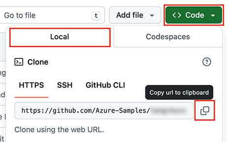

# Pizza API and MCP server for building AI Agents

## Getting started

There are multiple ways to get started with this project.

The quickest way is to use [GitHub Codespaces](#use-github-codespaces) that provides a preconfigured environment for you. Alternatively, you can [set up your local environment](#use-your-local-environment) following the instructions below.

<details open>
<summary><h3>Use GitHub Codespaces</h3></summary>

You can run this project directly in your browser by using GitHub Codespaces, which will open a web-based VS Code:

[](https://codespaces.new/Azure-Samples/pizza-mcp-agents?hide_repo_select=true&ref&quickstart=true)

</details>

<details>
<summary><h3>Use a VSCode dev container</h3></summary>

A similar option to Codespaces is VS Code Dev Containers, that will open the project in your local VS Code instance using the [Dev Containers extension](https://marketplace.visualstudio.com/items?itemName=ms-vscode-remote.remote-containers).

You will also need to have [Docker](https://www.docker.com/get-started/) installed on your machine to run the container.

[](https://vscode.dev/redirect?url=vscode://ms-vscode-remote.remote-containers/cloneInVolume?url=https://github.com/Azure-Samples/pizza-mcp-agents)

</details>

<details>
<summary><h3>Use your local environment</h3></summary>

You need to install following tools to work on your local machine:

- [Node.js LTS](https://nodejs.org/en/download)
- [Docker](https://www.docker.com/get-started/)
- [Azure Developer CLI](https://aka.ms/azure-dev/install)
- [Git](https://git-scm.com/downloads)
- [PowerShell 7+](https://github.com/powershell/powershell) _(for Windows users only)_
  - **Important**: Ensure you can run `pwsh.exe` from a PowerShell command. If this fails, you likely need to upgrade PowerShell.
  - Instead of Powershell, you can also use Git Bash or WSL to run the Azure Developer CLI commands.
- [Azure Functions Core Tools](https://learn.microsoft.com/azure/azure-functions/functions-run-local?tabs=macos%2Cisolated-process%2Cnode-v4%2Cpython-v2%2Chttp-trigger%2Ccontainer-apps&pivots=programming-language-javascript) _(should be installed automatically with NPM, only install manually if the API fails to start)_

Then you can get the project code:

1. [**Fork**](https://github.com/Azure-Samples/pizza-mcp-agents/fork) the project to create your own copy of this repository.
2. On your forked repository, select the **Code** button, then the **Local** tab, and copy the URL of your forked repository.

   
3. Open a terminal and run this command to clone the repo: `git clone <your-repo-url>`

</details>

## Deploy the project

After setting up your environment, you can deploy the project to Azure with these commands:

```bash
azd auth login
azd up
```

You can check the `README.md` file in each directory for more specific instructions.

## Trademarks

This project may contain trademarks or logos for projects, products, or services. Authorized use of Microsoft 
trademarks or logos is subject to and must follow 
[Microsoft's Trademark & Brand Guidelines](https://www.microsoft.com/en-us/legal/intellectualproperty/trademarks/usage/general).
Use of Microsoft trademarks or logos in modified versions of this project must not cause confusion or imply Microsoft sponsorship.
Any use of third-party trademarks or logos are subject to those third-party's policies.
