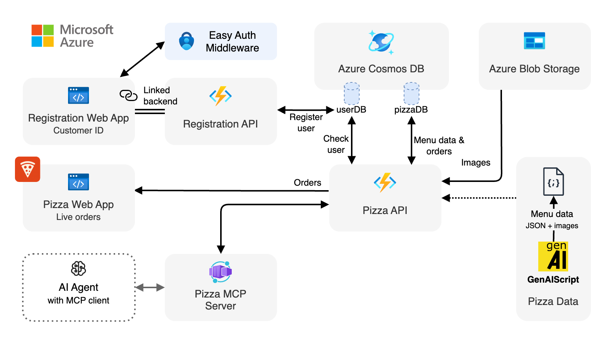

<div align="center">


# Pizza API and MCP server for building AI Agents

[](https://codespaces.new/Azure-Samples/pizza-mcp-agents?hide_repo_select=true&ref=main&quickstart=true)
[](https://github.com/Azure-Samples/pizza-mcp-agents/actions)

[](https://www.typescriptlang.org)
[](LICENSE)

⭐ If you like this sample, star it on GitHub — it helps a lot!

[Overview](#overview) • [Getting started](#getting-started) • [Local development](#local-development) • [Deploy to Azure](#deploy-to-azure) • [Resources](#resources) • [Troubleshooting](#troubleshooting)

</div>

This project demonstrates how to build AI agents that can interact with real-world APIs using the **Model Context Protocol (MCP)**. It features a complete pizza ordering system with a serverless API, web interfaces, and an MCP server that enables AI agents to browse menus, place orders, and track order status.

The system consists of multiple interconnected services:
- **Pizza API**: Serverless API for pizza ordering
- **Pizza MCP server**: MCP server enabling AI agent interactions
- **Pizza web app**: Live order dashboard, showing real-time pizza orders status
- **Registration system**: User registration for accessing the pizza ordering system

> [!TIP]
> You can test this application locally without deployment needed or any cloud costs. The MCP server works with popular AI tools like GitHub Copilot, Claude, and other MCP-compatible clients.

## Overview

This sample uses a microservices architecture deployed on Azure:

<div align="center">
  
</div>

### Core components

- **Pizza API** (Azure Functions): RESTful API handling pizza menu, orders, and business logic
- **Pizza MCP server** (Azure Container Apps): Exposes the pizza API through MCP, enabling AI agents to interact with the pizza ordering system
- **Pizza web app** (Azure Static Web Apps): Real-time dashboard for monitoring orders and system status
- **Registration API** (Azure Functions): User registration for accessing the pizza ordering system
- **Registration web app** (Azure Static Web Apps): Web interface for user registration

### MCP Tools Available

The Pizza MCP server provides these tools for AI agents:

| Tool | Description |
|------|-------------|
| `get_pizzas` | Retrieve all pizzas from the menu |
| `get_pizza_by_id` | Get specific pizza details by ID |
| `get_toppings` | List available toppings (filterable by category) |
| `get_topping_by_id` | Get specific topping details |
| `get_topping_categories` | List all topping categories |
| `get_orders` | Retrieve orders (filterable by user, status, time) |
| `get_order_by_id` | Get specific order details |
| `place_order` | Create a new pizza order |
| `delete_order_by_id` | Cancel pending orders |
| `get_image` | Retrieve image URLs for pizzas and toppings |

## Getting started

There are multiple ways to get started with this project. The quickest way is to use [GitHub Codespaces](#use-github-codespaces) that provides a preconfigured environment for you. Alternatively, you can [set up your local environment](#use-your-local-environment) following the instructions below.

<details open>
<summary><h3>Use GitHub Codespaces</h3></summary>

You can run this project directly in your browser by using GitHub Codespaces, which will open a web-based VS Code:

[](https://codespaces.new/Azure-Samples/pizza-mcp-agents?hide_repo_select=true&ref=main&quickstart=true)

</details>

<details>
<summary><h3>Use a VSCode dev container</h3></summary>

A similar option to Codespaces is VS Code Dev Containers, that will open the project in your local VS Code instance using the [Dev Containers extension](https://marketplace.visualstudio.com/items?itemName=ms-vscode-remote.remote-containers).

You will also need to have [Docker](https://www.docker.com/get-started/) installed on your machine to run the container.

[](https://vscode.dev/redirect?url=vscode://ms-vscode-remote.remote-containers/cloneInVolume?url=https://github.com/Azure-Samples/pizza-mcp-agents)

</details>

<details>
<summary><h3>Use your local environment</h3></summary>

You need to install following tools to work on your local machine:

- [Node.js LTS](https://nodejs.org/en/download)
- [Azure Developer CLI](https://aka.ms/azure-dev/install)
- [Git](https://git-scm.com/downloads)
- [PowerShell 7+](https://github.com/powershell/powershell) _(for Windows users only)_
  - **Important**: Ensure you can run `pwsh.exe` from a PowerShell command. If this fails, you likely need to upgrade PowerShell.
  - Instead of Powershell, you can also use Git Bash or WSL to run the Azure Developer CLI commands.
- [Azure Functions Core Tools](https://learn.microsoft.com/azure/azure-functions/functions-run-local?tabs=macos%2Cisolated-process%2Cnode-v4%2Cpython-v2%2Chttp-trigger%2Ccontainer-apps&pivots=programming-language-javascript) _(should be installed automatically with NPM, only install manually if the API fails to start)_
- [Docker](https://www.docker.com/get-started/)

Then you can get the project code:

1. [**Fork**](https://github.com/Azure-Samples/pizza-mcp-agents/fork) the project to create your own copy of this repository.
2. On your forked repository, select the **Code** button, then the **Local** tab, and copy the URL of your forked repository.

   
3. Open a terminal and run this command to clone the repo: `git clone <your-repo-url>`

</details>

## Local development

After setting up your environment, you can run the entire application locally:

```bash
# Install dependencies for all services
npm install

# Start all services locally
npm start
```

This will start:
- **Pizza Website**: http://localhost:4280
- **Registration Website**: http://localhost:5173  
- **Pizza API**: http://localhost:7071
- **Pizza MCP Server**: http://localhost:3000

> [!NOTE]
> When running locally without having deployed the application, the servers will use in-memory storage, so any data will be lost when you stop the servers.
> After a successful deployment, the servers will use Azure Cosmos DB for persistent storage.

### Testing the MCP Server

#### Using the MCP Inspector

You can test the MCP server using the MCP Inspector:

1. Install and start MCP Inspector:
   ```bash
   npx -y @modelcontextprotocol/inspector
   ```

2. In your browser, open the MCP Inspector (the URL will be shown in the terminal)

3. Configure the connection:
   - **Transport**: SSE or Streamable HTTP
   - **URL**: `http://localhost:3000/mcp` (for Streamable HTTP) or `http://localhost:3000/sse` (for legacy SSE)

4. Click **Connect** and explore the available tools

#### Using GitHub Copilot

To use the MCP server in local mode with GitHub Copilot, create a local `.vscode/mcp.json` configuration file in your project root:

```json
{
  "servers": {
    "pizza-mcp": {
      "command": "npm",
      "args": ["run", "-s", "mcp:local"],
      "env": {
        "PIZZA_API_URL": "http://localhost:7071"
      }
    }
  }
}
```

## Deploy to Azure

### Prerequisites

- **Azure account**: If you're new to Azure, [get an Azure account for free](https://azure.microsoft.com/free) to get free Azure credits to get started
- **Azure subscription with access enabled for the Azure OpenAI service** (if using AI features): You can request access with [this form](https://aka.ms/oaiapply)
- **Azure account permissions**: Your Azure account must have `Microsoft.Authorization/roleAssignments/write` permissions, such as [Role Based Access Control Administrator](https://learn.microsoft.com/azure/role-based-access-control/built-in-roles#role-based-access-control-administrator-preview), [User Access Administrator](https://learn.microsoft.com/azure/role-based-access-control/built-in-roles#user-access-administrator), or [Owner](https://learn.microsoft.com/azure/role-based-access-control/built-in-roles#owner)

### Deploy to Azure

1. Open a terminal and navigate to the root of the project
2. Authenticate with Azure by running `azd auth login`
3. Run `azd up` to deploy the application to Azure. This will provision Azure resources and deploy all services
   - You will be prompted to select a base location for the resources
   - The deployment process will take a few minutes

Once deployment is complete, you'll see the URLs of all deployed services in the terminal.

### Cost estimation

The application uses serverless and consumption-based Azure services to minimize costs:

- **Azure Functions**: Pay-per-execution pricing
- **Azure Static Web Apps**: Free tier available
- **Azure Container Apps**: Pay for actual usage
- **Azure Cosmos DB**: Serverless pricing model
- **Azure Blob Storage**: Pay for storage used

Estimated monthly cost for light usage (development/testing): **$10-30 USD**

### Clean up resources

To clean up all the Azure resources created by this sample:

```bash
azd down --purge
```

## Resources

Here are some resources to learn more about the technologies used in this project:

- [Model Context Protocol](https://modelcontextprotocol.io/) - Learn about MCP and building AI agents
- [Azure Functions](https://learn.microsoft.com/azure/azure-functions/functions-overview?pivots=programming-language-javascript) - Serverless compute platform
- [Azure Static Web Apps](https://learn.microsoft.com/azure/static-web-apps/overview) - Modern web app hosting
- [Azure Container Apps](https://learn.microsoft.com/azure/container-apps/overview) - Serverless containers
- [Azure Cosmos DB](https://learn.microsoft.com/azure/cosmos-db/nosql/) - NoSQL database service
- [GitHub Copilot](https://github.com/features/copilot) - AI-powered code completion
- [Azure Developer CLI](https://learn.microsoft.com/azure/developer/azure-developer-cli/overview) - Developer productivity toolchain

You can also find [more Azure AI samples here](https://github.com/Azure-Samples/azureai-samples).

## Troubleshooting

If you encounter issues while running or deploying this sample:

1. **Dependencies**: Ensure all required tools are installed and up to date
2. **Ports**: Make sure required ports (3000, 4280, 5173, 7071) are not in use
3. **Azure Developer CLI**: Verify you're authenticated with `azd auth login`
4. **Node.js version**: Ensure you're using Node.js 20 or higher

For more detailed troubleshooting, check the individual README files in each service directory.

## Trademarks

This project may contain trademarks or logos for projects, products, or services. Authorized use of Microsoft trademarks or logos is subject to and must follow [Microsoft's Trademark & Brand Guidelines](https://www.microsoft.com/en-us/legal/intellectualproperty/trademarks/usage/general). Use of Microsoft trademarks or logos in modified versions of this project must not cause confusion or imply Microsoft sponsorship. Any use of third-party trademarks or logos are subject to those third-party's policies.
