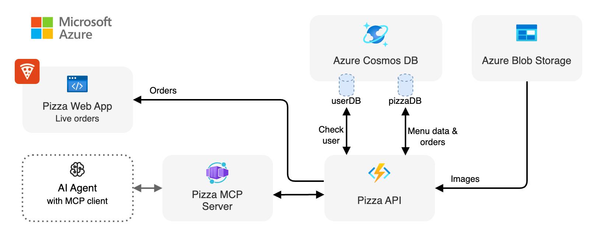

<div align="center">

# Pizza API (Azure Functions)

[](https://codespaces.new/Azure-Samples/pizza-mcp-agents?hide_repo_select=true&ref=main&quickstart=true)

[](https://www.typescriptlang.org)

[Overview](#overview) • [API Endpoints](#api-endpoints) • [Development](#development)

</div>

## Overview

This is the Pizza API, a serverless API that allows you to order delicious pizzas with various toppings. The API is designed to be simple and easy to use, providing endpoints for accessing pizza and topping information, placing orders, and managing your pizza experience.

The API is built with [Azure Functions](https://learn.microsoft.com/azure/azure-functions/functions-overview?pivots=programming-language-javascript).

<div align="center">
  
</div>

### Features

- **Serverless Architecture**: Built on Azure Functions for automatic scaling and cost efficiency
- **Pizza Management**: Retrieve pizza and topping information, including images
- **Order Management**: Place and manage orders with real-time status updates
- **OpenAPI Specification**: OpenAPI schema provided in YAML or JSON format

## API Endpoints

The Pizza API provides the following endpoints:

| Method | Path | Description |
|--------|------|-------------|
| GET | /api | Returns basic server status information including active and total orders |
| GET | /api/openapi | Returns the OpenAPI specification in YAML format (add `?format=json` for JSON) |
| GET | /api/pizzas | Returns a list of all pizzas |
| GET | /api/pizzas/{id} | Retrieves a specific pizza by its ID |
| GET | /api/toppings | Returns a list of all toppings (can be filtered by category with ?category=X) |
| GET | /api/toppings/{id} | Retrieves a specific topping by its ID |
| GET | /api/toppings/categories | Returns a list of all topping categories |
| GET | /api/orders | Returns a list of all orders in the system |
| POST | /api/orders | Places a new order with pizzas (requires `userId`) |
| GET | /api/orders/{orderId} | Retrieves an order by its ID |
| DELETE | /api/orders/{orderId} | Cancels an order if it has not yet been started (status must be 'pending', requires `userId` as a query parameter (e.g., `?userId={userId}`) |
| GET | /api/images/{filepath} | Retrieves image files (e.g., /api/images/pizzas/pizza-1.jpg) |

### Filtering orders

The `GET /api/orders` endpoint supports the following optional query parameters:

- `userId`: Filter orders by user ID.
- `status`: Filter by order status. You can provide multiple statuses as a comma-separated list (e.g. `pending,ready`).
- `last`: Filter orders created in the last X minutes or hours (e.g. `last=60m` for 60 minutes, `last=2h` for 2 hours).

**Note:** The `userId` property is never included in any order response for privacy reasons.

**Examples:**

```
GET /api/orders?userId=user123
GET /api/orders?status=pending,ready
GET /api/orders?last=2h
GET /api/orders?userId=user123&status=completed&last=60m
```

You can view the complete API documentation by opening the [Swagger Editor](https://editor.swagger.io/?url=http://localhost:7071/api/openapi) or the [OpenAPI YAML file](http://localhost:7071/api/openapi).

### Order Limits

A user can have a maximum of **5 active orders** (status: `pending` or `in-preparation`) at a time. If you try to place more, the API will return:

- HTTP 429 Too Many Requests
- Body: `{ "error": "Too many active orders: limit is 5 per user" }`

Each individual order is limited to a maximum of **50 pizzas total**. If you try to order more than 50 pizzas in a single order, the API will return:

- HTTP 400 Bad Request
- Body: `{ "error": "Order cannot exceed 50 pizzas in total" }`

This ensures fair use and prevents abuse.

### Order Nicknames

When placing an order, you can optionally provide a `nickname` field that will be displayed in the pizza website dashboard instead of the order ID. This makes it easier to identify orders in the interface.

**Example:**
```json
{
  "userId": "user123",
  "nickname": "John's Lunch Order",
  "items": [...]
}
```

- If a nickname is provided, the pizza website will display the first 8 characters of the nickname
- If no nickname is provided, the website will display the last 6 characters of the order ID preceded by a `#` symbol
- The nickname field is optional and doesn't affect order processing

### Order Status Automation

Order statuses are updated automatically by a timer function every 40 seconds:
- Orders move from 'pending' to 'in-preparation' 1-3 minutes after creation.
- Orders move from 'in-preparation' to 'ready' within 3 minutes around their estimated completion time. When an order is ready, the `readyAt` property is set to the ready timestamp (ISO date string).
- Orders move from 'ready' to 'completed' 1-2 minutes after being ready. When an order is completed, the `completedAt` property is set to the completion timestamp (ISO date string).

Estimated completion time is calculated as:
- 3-5 minutes for 1-2 pizzas, plus 1 minute for each additional pizza.

No manual API call is needed for these transitions.

## Development

### Getting started

Follow the instructions [here](../../README.md#getting-started) to set up the development environment for the entire Pizza MCP Agents project.

### Run the application

You can run the following command to run the application locally:

```bash
npm start
```

This command will start the Azure Functions application locally. You can test the application by opening the file `api.http` and click on **Send Request** to test the endpoints.

> [!NOTE]
> If you have not deployed the Azure resources, it will fall back to in-memory data. You can test the API without deploying it to Azure.

### Available Scripts

| Script | Description |
|--------|-------------|
| `npm start` | Start the development server with hot reload and Azurite storage emulator |
| `npm run build` | Build the TypeScript source |
| `npm run clean` | Clean build artifacts |
| `npm run start:storage` | Start local Azurite storage emulator |
| `update:local-settings` | Create or update `local.settings.json` with environment variables from Azure |

### Configuration

The application uses environment variables for configuration:

| Variable | Description | Default |
|----------|-------------|---------|
| `AZURE_COSMOSDB_NOSQL_ENDPOINT` | Azure Cosmos DB endpoint | `""` (not set) |
| `AZURE_STORAGE_URL` | Azure Storage URL for images | `""` (not set) |
| `AZURE_STORAGE_CONTAINER_NAME` | Azure Storage container name for images | `""` (not set) |

> [!NOTE]
> When running locally without any configuration set, the API will automatically use in-memory storage for the database and file access for the images, and log this behavior.
