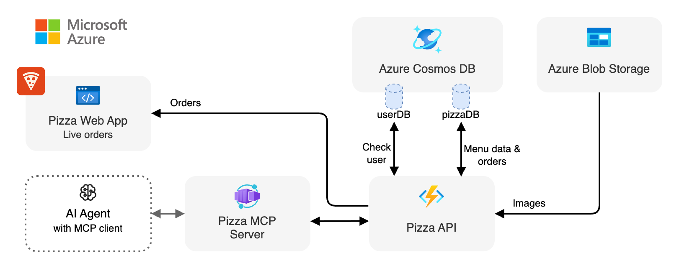

<div align="center">

# Pizza Orders Web App (Azure Static Web Apps)

[](https://codespaces.new/Azure-Samples/pizza-mcp-agents?hide_repo_select=true&ref=main&quickstart=true)

[](https://www.typescriptlang.org)
[](https://lit.dev)

[Overview](#overview) • [Development](#development)

</div>

## Overview

This website provides a dashboard visualisation interface for the live orders made through the Pizza API. This application is built using [Azure Static Web Apps](https://learn.microsoft.com/azure/static-web-apps/) and uses the Azure Functions Pizza API to acess the data.

<div align="center">
  
</div>

### Features
- **Live Orders Dashboard**: Displays all current orders in real-time
- **Responsive Design**: Optimized for both desktop and mobile devices
- **Static Hosting**: Global content delivery through Azure Static Web Apps

## Development

### Getting started

Follow the instructions [here](../../README.md#getting-started) to set up the development environment for the entire Pizza MCP Agents project.

### Run the application

You can run the following command to run the application locally:

```bash
npm start
```

This command will start the [Vite](https://vitejs.dev/) development server and the Azure Functions emulator with the Pizza API. This will allow you to test the website locally, using the URL `http://localhost:5173`.

### Available scripts

| Command | Description |
|---------|-------------|
| `npm start` | Start the web app server and the Functions emulator for the Pizza API |
| `npm run start:mock` | Start the web app server with mocked data (useful for testing without the API) |
| `npm run dev` | Start only the Vite development server |
| `npm run build` | Build the application for production |
| `npm run preview` | Preview the production build locally |
| `npm run serve` | Start both the web app and API in development mode |

### Configuration

The application uses environment variables for configuration:

| Variable | Description | Default |
|----------|-------------|---------|
| `PIZZA_API_URL` | Pizza API base URL | `""` (auto-detected) |

For local development, this doesn't need to be set thanks to Vite development server proxying.
