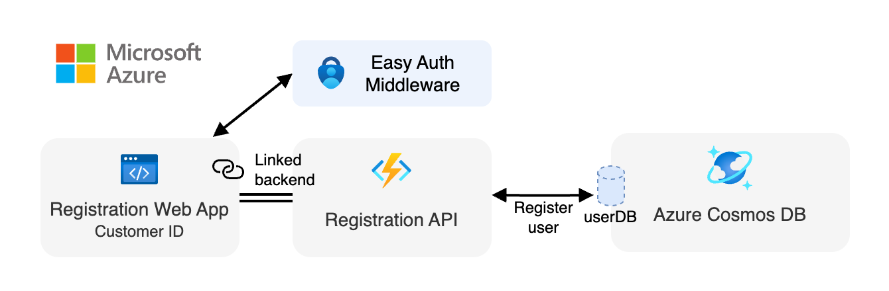

<div align="center">

# Registration API (Azure Functions)

[](https://codespaces.new/Azure-Samples/pizza-mcp-agents?hide_repo_select=true&ref=main&quickstart=true)

[](https://www.typescriptlang.org)

[Overview](#overview) • [Development](#development) • [API Reference](#api-reference)

</div>

A serverless user registration API built with [**Azure Functions**](https://learn.microsoft.com/azure/azure-functions/functions-overview?pivots=programming-language-javascript) that provides secure access token management for authenticated users. This service is part of the [Pizza MCP Agents](../../README.md) project and enables secure access to the pizza ordering system through unique user tokens.

## Overview

This registration API serves as an authentication and authorization layer for the pizza ordering system. It integrates seamlessly with **Azure Static Web Apps** authentication and uses **Azure Cosmos DB** for persistent token storage, with automatic fallback to in-memory storage for local development.

The API follows serverless best practices and is designed to handle user registration and token management with minimal latency and automatic scaling.

<div align="center">
  
</div>

### Features

- **Serverless Architecture**: Built on Azure Functions for automatic scaling and cost efficiency
- **Secure Token Management**: Generates and manages unique access tokens per user
- **Azure Integration**: Native integration with Azure Static Web Apps authentication
- **User Privacy**: Stores only hashed user IDs, not personal information

## Development

### Getting started

Follow the instructions [here](../../README.md#getting-started) to set up the development environment for the entire Pizza MCP Agents project.

### Run the application

Start the development environment:

```bash
npm start
```

This command will start the Azure Functions emulator with the Registration API at `http://localhost:7072`.
You can then use the `api.http` file to test the API endpoints using the [REST Client](https://marketplace.visualstudio.com/items?itemName=humao.rest-client) VS Code extension, or any HTTP client like `curl`.

### Available Scripts

| Script | Description |
|--------|-------------|
| `npm start` | Start the development server with hot reload |
| `npm run build` | Build the TypeScript source |
| `npm run clean` | Clean build artifacts |
| `npm run dev:storage` | Start local Azurite storage emulator |
| `update:local-settings` | Create or update `local.settings.json` with environment variables from Azure |

### Configuration

The application uses environment variables for configuration:

| Variable | Description | Default |
|----------|-------------|---------|
| `AZURE_COSMOSDB_NOSQL_ENDPOINT` | Azure Cosmos DB endpoint | `""` (not set) |

> [!NOTE]
> When running locally without any Cosmos DB configuration set, the API will automatically use in-memory storage and log this behavior.

## API Reference

This API provides a single endpoint for user registration and token management. On the first request, a new user is created with a unique access token if it doesn't exist. Subsequent requests return the existing token for the user.

**`GET /api/me/access-token`**

Returns a unique access token for the authenticated user. If the user doesn't exist, creates a new user record with a fresh token.

#### Headers

| Header | Type | Required | Description |
|--------|------|----------|-------------|
| `x-ms-client-principal` | string | Yes | Base64-encoded JSON containing user info from Azure Static Web Apps |

#### Response

```json
{
  "accessToken": "550e8400-e29b-41d4-a716-446655440000"
}
```

#### Status Codes

- `200` - Success
- `401` - Unauthorized (missing or invalid auth header)
- `500` - Internal server error
