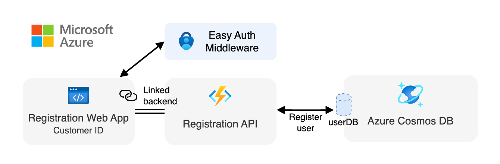

<div align="center">

# Registration Web App (Azure Static Web Apps)

[](https://codespaces.new/Azure-Samples/pizza-mcp-agents?hide_repo_select=true&ref=main&quickstart=true)

[](https://www.typescriptlang.org)
[](https://lit.dev)

[Overview](#overview) • [Development](#development)

</div>

A modern web application that provides user registration and authentication for accessing the Pizza API. Built with [Lit components](https://lit.dev) and [Azure Static Web Apps](https://learn.microsoft.com/azure/static-web-apps/), this application enables users to authenticate through GitHub or Microsoft accounts and obtain unique access tokens.

## Overview

This registration website serves as the authentication gateway for the Pizza API ecosystem. Users can sign in using their preferred identity provider (GitHub or Microsoft) and receive a unique `userId` that grants them access to the Pizza API endpoints.

The application leverages Azure Static Web Apps' built-in authentication features, providing a secure and seamless user experience without requiring complex authentication setup.

<div align="center">
  
</div>

### Features

- **Registration Interface**: Lit-based web components for user authentication and token display
- **Authentication Service**: Azure Static Web Apps built-in authentication with GitHub and Microsoft providers
- **Token Management**: Integration with the Registration API for secure token generation and storage
- **Static Hosting**: Global content delivery through Azure Static Web Apps

## Development

### Getting started

Follow the instructions [here](../../README.md#getting-started) to set up the development environment for the entire Pizza MCP Agents project.

### Run the application

Start the development environment:

```bash
npm start
```

This command will:
- Start the Vite development server for the web application
- Launch the Azure Functions emulator with the Registration API
- Enable the Azure Static Web Apps CLI authentication emulator
- Open the application at `http://localhost:4280`

> [!NOTE]
> The application includes authentication emulation for local development, allowing you to test the full authentication flow without deploying to Azure.

### Available scripts

| Command | Description |
|---------|-------------|
| `npm start` | Start the full development environment with SWA authentication emulator |
| `npm run dev` | Start only the Vite development server |
| `npm run build` | Build the application for production |
| `npm run preview` | Preview the production build locally |
| `npm run serve` | Start both the web app and API in development mode |

### Component usage

The application provides reusable Lit components for authentication:

```typescript
// Authentication component with multiple providers
<reg-auth type="login"></reg-auth>

// User registration and token display
<register-user></register-user>
```

### Configuration

The application uses environment variables for configuration:

| Variable | Description | Default |
|----------|-------------|---------|
| `REGISTRATION_API_URL` | Registration API base URL | `""` (auto-detected) |

For local development, this doesn't need to be set thanks to Azure Static Web Apps CLI server proxying.
